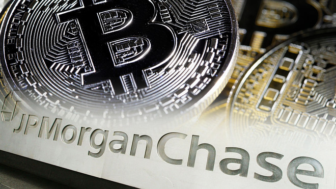

# JPM-Coin-Case-Study

## JP Morgan To Launch Its Own Cryptocurrency

Write description content here

Contributors: Joe Swidersky, Robert Laughry, Jonathan Park

### JPM Coin Case Study

1. What is the background of your company? What do they do? Who are their competitors?

JPMorgan Chase & Co. is an American multinational investment bank and financial services holding company headquartered in New York City. JPMorgan Chase is ranked by S&P Global as the largest bank in the United States and the sixth largest bank in the world by total assets, with total assets of US$2.687 trillion

Competitors: Bank of America, Wells Fargo, CitiBank, et al.
2. How does this company use technology to their advantage? Why are they considred a FinTech company?
JPMorgan has digitized virtually all of their business processes to include Online Banking, Mortgage, Auto Loans, etc.
3. Why is this company exmplary in the FinTech space? What are their strengths and weaknesses?
Write answer here
4. What is the prognosis for this company? Where do they expect to be in the future?
